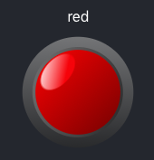

# Colored Led

A React component that renders a round indicator light, its color is programmable.



## Usage

`npm install --save colored-led`

Include it in your project:

```
import ColoredLed from 'colored-led';
```

...

```
<div style="height:64px; width:64px;">
  <ColoredLed color="red" />
</div>
```

The size of its container drives the size of the ColoredLed.

## Demo

[Watch this demo](https://hirle.github.io/colored-led/demo/build/)